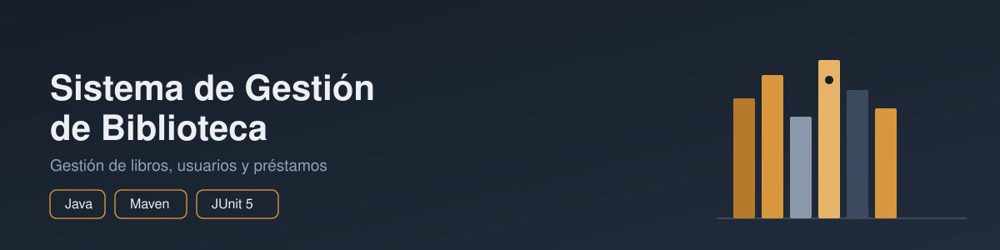

# 📚 Sistema de Gestión de Biblioteca

    [](https://github.com/Mvilla44/biblioteca/actions/workflows/maven-tests.yml)

Aplicación de consola desarrollada en **Java** para administrar una biblioteca mediante libros, usuarios y préstamos. El proyecto fue construido como práctica de programación orientada a objetos y como proyecto de portafolio, incorporando **Maven, JUnit 5, Git/GitHub e integración continua con GitHub Actions**. Además, incluye un **asistente de IA** integrado que responde preguntas en lenguaje natural sobre el catálogo, usando la API de Gemini.

---

## 📑 Tabla de contenido

- [Características](#-características)
- [Tecnologías](#-tecnologías)
- [Arquitectura y diseño](#-arquitectura-y-diseño)
- [Asistente de IA](#-asistente-de-ia)
- [Estructura del proyecto](#-estructura-del-proyecto)
- [Pruebas automatizadas](#-pruebas-automatizadas)
- [Integración Continua (CI/CD)](#️-integración-continua-cicd)
- [Gestión de datos](#-gestión-de-datos)
- [Excepciones personalizadas](#️-excepciones-personalizadas)
- [Requisitos](#-requisitos)
- [Instalación y ejecución](#-instalación-y-ejecución)
- [Objetivo del proyecto](#-objetivo-del-proyecto)
- [Autor](#-autor)

---

## ✨ Características

- Gestión de libros: agregar, buscar, mostrar y eliminar.
- Gestión de usuarios: agregar, buscar, mostrar y eliminar.
- Préstamo y devolución de libros.
- Control de libros disponibles y prestados.
- Restricciones de negocio, como impedir préstamos duplicados o eliminar libros prestados.
- Tres tipos de usuario: `Student`, `Profesor` y `Admin`.
- Creación de usuarios mediante `UserFactory`.
- Excepciones personalizadas para errores del dominio.
- Pruebas automatizadas con JUnit 5.
- Pipeline de integración continua con GitHub Actions.
- **Asistente de IA** que responde preguntas en lenguaje natural sobre el catálogo de libros, usando la API de Gemini con el contexto real de la biblioteca.

## 🛠 Tecnologías

| Tecnología      | Uso                                                          |
| ---------------- | ------------------------------------------------------------ |
| Java 25           | Lenguaje y desarrollo de la aplicación                        |
| Maven             | Gestión del proyecto, dependencias y ejecución de pruebas     |
| JUnit 5           | Pruebas automatizadas                                         |
| Git               | Control de versiones                                          |
| GitHub            | Repositorio y publicación del proyecto                        |
| Gemini API        | Asistente de IA en lenguaje natural sobre el catálogo          |
| Jackson           | Parseo de las respuestas JSON de la API de Gemini              |
| GitHub Actions    | Integración continua (CI) — ejecución automática de pruebas   |

## 🏗 Arquitectura y diseño

El proyecto aplica principios de programación orientada a objetos para separar responsabilidades y representar el dominio de la biblioteca.

### Principales clases

- `Library`: administra libros, usuarios y préstamos y concentra las reglas principales del negocio.
- `Book`: representa un libro y sus datos principales.
- `User`: clase abstracta base para los usuarios.
- `Student`, `Profesor` y `Admin`: especializaciones de `User`.
- `Prestamo`: representa un préstamo y controla su estado activo o devuelto.
- `UserFactory`: centraliza la creación de los diferentes tipos de usuario.
- `GestionPrestamos`: define las operaciones relacionadas con préstamos y devoluciones.
- `OperacionesAdministrativas`: define operaciones administrativas de la biblioteca.
- `AsistenteBiblioteca`: construye el contexto a partir de los datos reales de `Library` y orquesta la consulta al asistente de IA.
- `GeminiClient`: encapsula la comunicación HTTP con la API de Gemini y el parseo de la respuesta.

### Conceptos aplicados

- **Encapsulamiento:** atributos privados y acceso mediante métodos.
- **Herencia:** `Student`, `Profesor` y `Admin` heredan de `User`.
- **Abstracción:** `User` define el comportamiento común de los usuarios.
- **Polimorfismo:** cada tipo de usuario puede implementar su comportamiento específico.
- **Interfaces:** separación de responsabilidades mediante `GestionPrestamos` y `OperacionesAdministrativas`.
- **Colecciones:** uso de `Map` y `List` para gestionar entidades y préstamos.
- **Excepciones personalizadas:** errores específicos del dominio tratados de forma explícita.
- **Factory Pattern:** `UserFactory` encapsula la creación de usuarios.
- **Inmutabilidad:** identificadores y referencias que no deben cambiar se mantienen como `final`.
- **Separación de responsabilidades:** el módulo de IA (`com.miguel.ia`) vive aislado del dominio de negocio, sin acoplar `Library` a la lógica de IA.

## 🤖 Asistente de IA

El sistema incluye un asistente conversacional (opción del menú "Preguntar al asistente") que responde preguntas en lenguaje natural sobre el catálogo, por ejemplo:

- *"¿qué libros tienes disponibles?"*
- *"¿cuál es el libro más antiguo?"*
- *"recomiéndame un libro clásico"*

**Cómo funciona:**

1. `AsistenteBiblioteca` construye un contexto en texto a partir de los libros reales almacenados en `Library` (título, autor, año y disponibilidad, calculada según los préstamos activos).
2. Ese contexto se envía junto con la pregunta del usuario a la API de Gemini (`gemini-3.6-flash`) a través de `GeminiClient`.
3. `GeminiClient` parsea la respuesta JSON con Jackson y devuelve solo el texto generado, listo para mostrarse en consola.

Al construir el contexto desde los datos reales del sistema (en vez de dejar que el modelo responda de memoria), se evita que la IA invente libros o información que no existe en el catálogo.

**Configuración:**

El proyecto necesita una API key gratuita de Google AI Studio, provista como variable de entorno:

```
GEMINI_API_KEY=tu_clave_aquí
```

Puedes obtener una clave gratuita en [aistudio.google.com](https://aistudio.google.com/app/apikey) (no requiere tarjeta de crédito).

## 📂 Estructura del proyecto

```
biblioteca/
├── .github/
│   └── workflows/
│       └── maven-tests.yml
├── src/
│   ├── main/
│   │   └── java/
│   │       └── com/
│   │           └── miguel/
│   │               ├── Admin.java
│   │               ├── Book.java
│   │               ├── GestionPrestamos.java
│   │               ├── Library.java
│   │               ├── Main.java
│   │               ├── OperacionesAdministrativas.java
│   │               ├── Prestamo.java
│   │               ├── Profesor.java
│   │               ├── Student.java
│   │               ├── User.java
│   │               ├── UserFactory.java
│   │               ├── Excepciones/
│   │               │   ├── LibroNoEncontradoException.java
│   │               │   ├── LibroPrestadoException.java
│   │               │   ├── LibroYaExisteException.java
│   │               │   ├── TipoUsuarioInvalidoException.java
│   │               │   ├── UsuarioNoEncontradoException.java
│   │               │   └── UsuarioYaExisteException.java
│   │               └── ia/
│   │                   ├── AsistenteBiblioteca.java
│   │                   └── GeminiClient.java
│   └── test/
│       └── java/
│           └── com/
│               └── miguel/
│                   └── LibraryTest.java
├── docs/
├── .gitignore
├── pom.xml
└── README.md
```

## ✅ Pruebas automatizadas

El proyecto cuenta actualmente con **22 pruebas automatizadas** para validar escenarios de libros, usuarios, préstamos, devoluciones, excepciones y creación de usuarios.

Las pruebas se encuentran en:

```
src/test/java/com/miguel/LibraryTest.java
```

Para ejecutarlas:

```
mvn clean test
```

El resultado esperado es:

```
BUILD SUCCESS
```

### Ejemplos de reglas de negocio probadas

- No permitir registrar dos libros con el mismo ID.
- Lanzar una excepción cuando se busca un libro inexistente.
- No permitir prestar un libro que ya está prestado.
- Permitir devolver correctamente un libro prestado.
- Impedir que un usuario devuelva un libro que pertenece a otro préstamo.
- No permitir registrar usuarios con IDs duplicados.
- No permitir eliminar usuarios que mantienen préstamos activos.
- Validar tipos de usuario no soportados en `UserFactory`.
- Impedir crear préstamos sin libro o usuario válidos.
- Impedir devolver un préstamo que ya fue cerrado.

## ⚙️ Integración Continua (CI/CD)

El proyecto cuenta con un workflow de **GitHub Actions** que ejecuta automáticamente la suite de pruebas en cada `push` o `pull request` hacia la rama `main`.

Archivo de configuración:

```
.github/workflows/maven-tests.yml
```

**Pasos del pipeline:**

1. Clona el repositorio (`actions/checkout@v5`).
2. Configura el entorno con JDK 25 (`actions/setup-java@v5`, distribución Temurin).
3. Ejecuta `mvn clean test`, corriendo las 22 pruebas unitarias del proyecto.

Esto garantiza que cada cambio subido al repositorio mantenga la suite de pruebas en estado exitoso, evitando regresiones sin depender de ejecutarlas manualmente antes de cada entrega.

Puedes ver el historial de ejecuciones en la pestaña [Actions](https://github.com/Mvilla44/biblioteca/actions) del repositorio.

## 🗄 Gestión de datos

`Library` mantiene la información en memoria mediante colecciones de Java:

- `Map<Integer, Book>` para los libros identificados por ID.
- `Map<Integer, User>` para los usuarios identificados por ID.
- `List<Prestamo>` para los préstamos registrados.

Se utiliza el tipo de colección (`Map`/`List`) en las declaraciones para reducir el acoplamiento con una implementación concreta y mantener el diseño más flexible.

## ⚠️ Excepciones personalizadas

El proyecto cuenta con excepciones específicas para representar errores del dominio, entre ellas:

- `LibroNoEncontradoException`
- `LibroPrestadoException`
- `LibroYaExisteException`
- `TipoUsuarioInvalidoException`
- `UsuarioNoEncontradoException`
- `UsuarioYaExisteException`

Esto permite separar los errores propios de la aplicación de errores genéricos de ejecución.

## 📋 Requisitos

- **JDK 25**
- **Maven 3.9.x** o compatible
- Git, si se desea clonar el repositorio
- Una API key gratuita de Gemini (Google AI Studio), configurada como variable de entorno `GEMINI_API_KEY`, para usar el asistente de IA

Comprobar versiones:

```
java -version
mvn -version
```

## 🚀 Instalación y ejecución

Clonar el proyecto:

```
git clone https://github.com/Mvilla44/biblioteca.git
cd biblioteca
```

Configurar la variable de entorno con tu API key de Gemini:

```
GEMINI_API_KEY=tu_clave_aquí
```

Ejecutar las pruebas:

```
mvn clean test
```

Ejecutar la aplicación desde IntelliJ IDEA mediante:

```
com.miguel.Main
```

## 🎯 Objetivo del proyecto

Este proyecto busca demostrar el dominio práctico de conceptos fundamentales de Java y herramientas utilizadas en un flujo de desarrollo real: programación orientada a objetos, colecciones, interfaces, herencia, polimorfismo, excepciones personalizadas, pruebas automatizadas, Maven, control de versiones con Git e integración continua con GitHub Actions, y la integración de un servicio de IA externo en una arquitectura ya existente.

## 👤 Autor

**Miguel Villa**

GitHub: [Mvilla44](https://github.com/Mvilla44)
